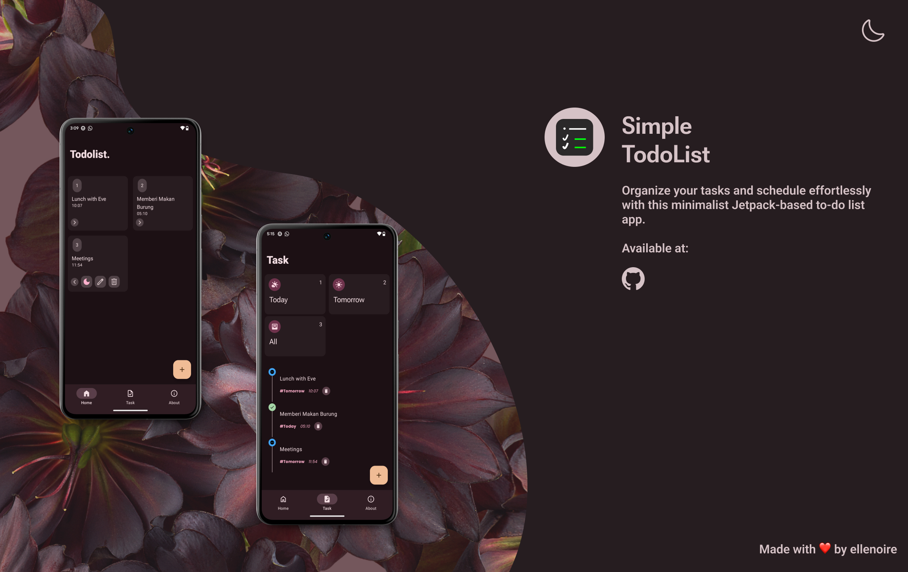

# To-Do List App - Simple Task Manager with Jetpack Compose



This **To-Do List** app is a simple task management application built using **Jetpack Compose**, Android's modern toolkit for building UIs declaratively. The app allows users to create, edit, and delete their tasks with an intuitive and responsive interface.

## Features:
- **Add New Tasks**: Quickly and easily add new tasks.
- **Edit and Delete Tasks**: Manage existing tasks with the ability to edit or delete them.
- **Mark Tasks as Done**: Easily mark tasks as completed.
- **Modern UI with Jetpack Compose**: A clean, responsive design using Jetpack Compose for a better user experience.

## Libraries:
- **Jetpack Compose**: A declarative UI framework for Android development.
- **Hilt**: Dependency injection for easier and cleaner dependency management.
- **Room Database**: For locally storing tasks and data on the device.
- **Kotlin**: A modern programming language for Android development.

## Setup and Installation:

1. Clone the repository:
   ```bash
   git clone https://github.com/ellenoireQ/Compose-simple-to-do-list.git
2. Open the project in Android Studio.
3. Sync Project.
4. Build Project.


